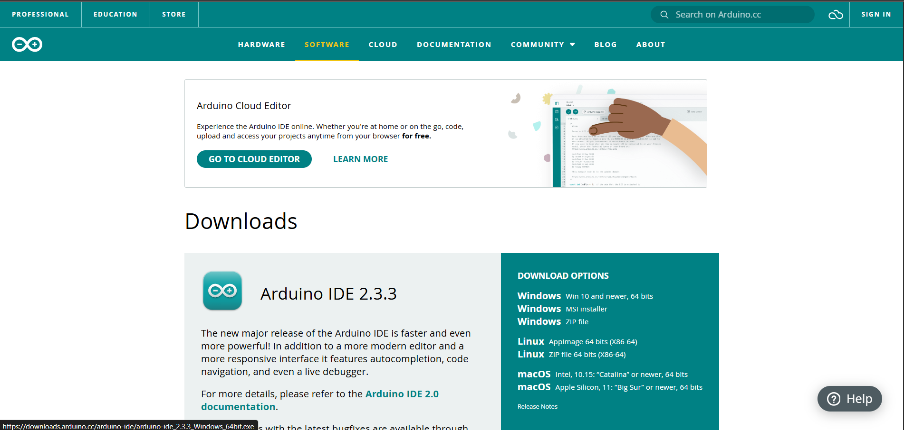

# Utiliser la carte Metro avec ArduinoIDE

Cette partie sert à decrire comment utiliser la carte Adafruit Metro avec Arduino IDE

<table data-view="cards"><thead><tr><th></th><th></th><th></th></tr></thead><tbody><tr><td></td><td></td><td>Arduino IDE, sert à programmer la carte</td></tr><tr><td></td><td></td><td>Carte Adafruit Metro</td></tr></tbody></table>

Afin de d'utiliser cette carte avec Arduino IDE, il faut suivre ces etapes :&#x20;

1. [#telecharger-arduino-ide](utiliser-la-carte-metro-avec-arduinoide.md#telecharger-arduino-ide "mention")
2. [#ajouter-la-carte-dans-lide](utiliser-la-carte-metro-avec-arduinoide.md#ajouter-la-carte-dans-lide "mention")
3. [#installer-la-carte-dans-boards-manager](utiliser-la-carte-metro-avec-arduinoide.md#installer-la-carte-dans-boards-manager "mention")
4. [#connecter-la-carte-metro-a-lide](utiliser-la-carte-metro-avec-arduinoide.md#connecter-la-carte-metro-a-lide "mention")

***

### Telecharger Arduino IDE :&#x20;

Telecharger le logiciel depuis le lien [https://www.arduino.cc/en/software](https://www.arduino.cc/en/software)

<figure><figcaption>
Page de telechargement de Arduino IDE
</figcaption></figure>

### Ajouter la carte dans l'IDE&#x20;

Apres ouverture de l'IDE, on ouvre l'onglet `File > Preferences`

<figure><figcaption></figcaption></figure>

On ajoute le lien [`https://adafruit.github.io/arduino-board-index/package_adafruit_index.json`](https://adafruit.github.io/arduino-board-index/package\_adafruit\_index.json) dans l'espace `Additional Boards URLs`.

<figure><figcaption></figcaption></figure>


To find the most up to date list of URLs you can add, you can visit the list of [third party board URLs on the Arduino IDE wiki](https://github.com/arduino/Arduino/wiki/Unofficial-list-of-3rd-party-boards-support-urls#list-of-3rd-party-boards-support-urls).


### Installer la carte dans _<mark style="background-color:orange;">Boards Manager</mark>_

Ouvrir l'onglet `Tools > Boards > Boards Manager`

Rechercher et Installer `AdaFruit AVR Boards`

<figure><figcaption></figcaption></figure>

### Connecter la carte Metro à l'IDE

Ouvrir l'onglet `Tools > Boards > Adafruit AVR Boards` et choisir `Adafruit Metro` .

<figure><figcaption></figcaption></figure>
